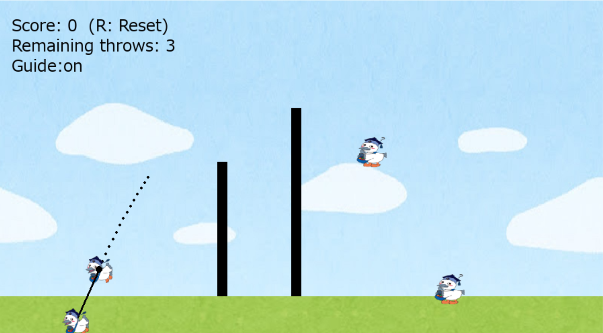

# アングリーこうかとん

## 実行環境の必要条件
* python >= 3.10
* pygame >= 2.1

## ゲームの概要
* プレイヤーのコマ,こうかとんをマウス操作で引っ張って敵のキャラ全員滅ぼすゲーム
* 壁と敵配置はランダムなので運もあるかも...
* 次のステージに行くと残機は戻ります

## ゲームの遊び方
* ただのコマであるこうかとんをマウス操作で引っ張り,敵に当てることで倒せます
* 残機が無くなるまでに全員倒せればクリア
* Rキーでリセット,Gキーでガイド表示,Enterキーで急降下

## ゲームの実装
### 共通基本機能
* 背景画像とキャラクター,引っ張る操作

### 分担追加機能
* ステージ追加(担当:守山):ステージの更新または,追加ステージ
* ステージギミック(動かせたら理想の壁)(担当:畠):プレイヤーを邪魔する壁
* ガイド表示(担当:国分):Gキーでどう飛ぶのかを視覚化
* 能力(下にドッカンでしょ)(担当:片倉):Enterキーを押すと急降下
* 残機(担当:宗):挑戦回数である残機の実装

### ToDo
* 壁を動かす
* 敵を動かす
* 敵のHP追加

### メモ
* 追加機能は主に新たなクラスを作成して実装してください
